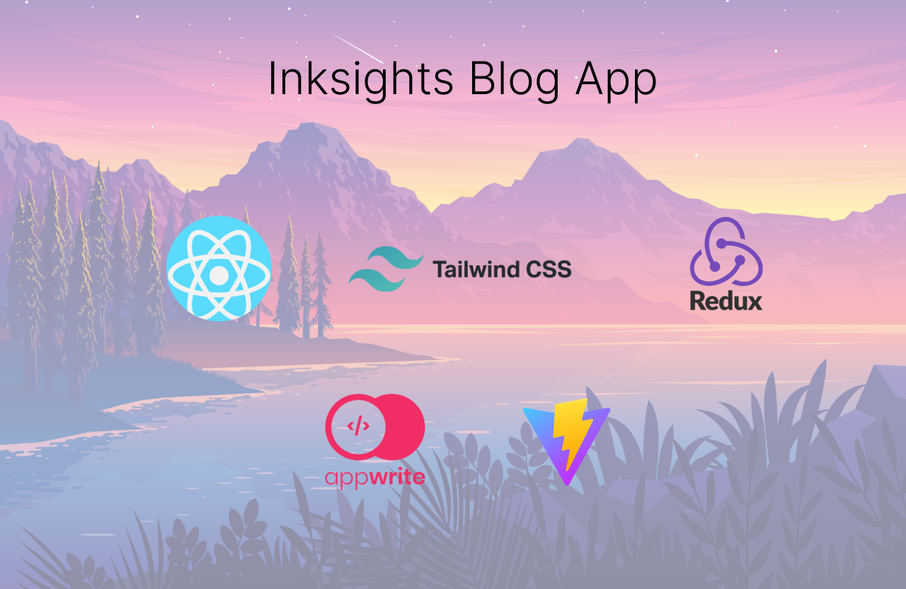

# Inksights 📝✨

Welcome to Inksights, your go-to platform for writing and reading blogs with ease!



## Features

✍️ **Write Blogs**: Users can easily write and publish their own blogs.

📖 **Read Blogs**: Explore a diverse collection of blogs written by other users.

🔒 **Authentication**: Secure user authentication powered by Appwrite ensures a safe and reliable login experience.

🔄 **State Management**: Utilize Redux for efficient state management, ensuring smooth user interactions and data handling.

🎨 **Tailwind CSS**: Enhance the design and aesthetics of your blogs with Tailwind CSS, providing a modern and responsive layout.

🖋️ **Blog Form**: Integration with TinyMCE allows users to compose their blogs with rich text editing capabilities.

## Installation

1. Clone the repository:
  ```bash
  git clone https://github.com/adityaaa007/inksights.git
   ```
2. Install dependencies:
  ```bash
  cd inksights
  npm install
   ```
3. Start the development server:
  ```bash
  npm run dev
   ```

## Contributing

We welcome contributions from the community! Whether it's bug fixes, feature enhancements, or documentation improvements, feel free to submit pull requests.